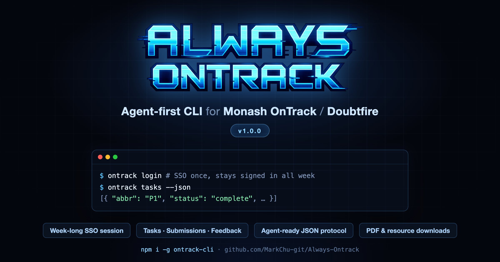

# Always Ontrack (ontrack-cli)

[English](./README.md)

<p align="center">
  
</p>

<p align="center">
  面向 Agent 的 Monash OnTrack / Doubtfire CLI 与鉴权 MCP
</p>

`ontrack-cli` 把 Monash OnTrack 中常见的登录、查看任务、跟踪反馈、下载 PDF、上传
submission 等操作统一到一个命令面（`ontrack <command>`），默认面向 Monash OnTrack
站点（`https://ontrack.infotech.monash.edu/api`）。主要接口是版本化、可发现 Schema
的 Agent 协议；人类表格与交互启动器继续复用同一执行引擎。

详细指南（英文）:[认证](docs/authentication.md) ·
[Agent 使用](docs/agent-usage.md) · [命令](docs/commands.md) ·
[工作流](docs/workflows.md) · [故障排查](docs/troubleshooting.md) ·
[开发](docs/development.md)

## 目录

- [功能概览](#功能概览)
- [安装](#安装)
- [快速开始](#快速开始)
- [认证](#认证)
- [Agent-first 使用方式](#agent-first-使用方式)
- [命令参考](#命令参考)
- [环境变量](#环境变量)
- [故障排查](#故障排查)
- [开发](#开发)
- [项目结构](#项目结构)
- [当前边界](#当前边界)
- [许可证](#许可证)

## 功能概览

- 登录与会话管理——配对中继（pairing relay）登录（所有环境默认）、受控浏览器捕获、
  手动 redirect URL 导入、直接传入 token、从受限浏览器状态静默续期，以及本地
  `ontrack-auth-mcp` 鉴权控制面
- 学习数据读取——`projects`、`units`、`tasks`、`inbox`、`task show`、`task resources`
- 反馈与实时跟踪——`feedback list`、`feedback watch`、`watch`
- 文件能力——`pdf task`、`pdf submission`、`task resources`、
  `submission upload`、`submission upload-new-files`
- 工程与排障——`doctor`、`discover`、`discover --probe`
- 终端体验——默认彩色高亮表格输出；`--output agent-json` 提供版本化 Agent 自动化
  协议；旧 `--json` 保持原始脚本输出兼容；自动处理部分 endpoint 权限差异和 fallback

## 安装

运行环境:HTTP CLI 与 Auth MCP 需要 Bun `1.3.14+`（实验性 Lightpanda provider 额外
要求 Bun `1.4.0+`）；macOS / Linux / Windows（Lightpanda spike 目前仅限
macOS/Linux——在实现可执行文件 ACL 校验前，Windows 一律 fail closed）；需要手动安装
经过审核的浏览器 runtime 时，请保证网络可用。

全局安装（推荐）:

```bash
bun add --global ontrack-cli
```

安装后提供 `ontrack` 与 `ontrack-auth-mcp` 两个命令入口。也可以从源码运行:

```bash
bun install
bun run build
bun dist/cli.js auth-method   # 或: bun run dev -- auth-method
```

## 快速开始

下面是一套最短、最稳的上手路径。

1. 登录——`ontrack login` 会打印一次性配对链接，在你自己的浏览器（任意设备）里
   完成登录:

   ```bash
   ontrack login
   ```

2. 查看当前账号并列出你的数据:

   ```bash
   ontrack whoami
   ontrack projects
   ontrack units
   ontrack tasks
   ```

3. 查看某个具体任务（批量选择器同样可用:`--abbr P1,D4`、`--all-tasks`）:

   ```bash
   ontrack task show --project-id 87 --abbr D4
   ```

4. 查看反馈、实时消息并下载 PDF:

   ```bash
   ontrack feedback list --project-id 87 --abbr D4
   ontrack feedback watch --project-id 87 --abbr D4
   ontrack pdf task --project-id 87 --abbr D4
   ontrack pdf submission --project-id 87 --abbr D4
   ```

5. 先预检，再确认上传（不带 `--confirm` 时只做安全预检，不发送写请求）:

   ```bash
   ontrack submission upload --project-id 87 --abbr D4 --file ./report.pdf
   ontrack submission upload --project-id 87 --abbr D4 --file ./report.pdf --confirm
   ```

不带参数运行 `ontrack` 会打开交互式启动器并引导选择任务。端到端流程见
[docs/workflows.md](docs/workflows.md)（英文）。

## 认证

`ontrack login` 在所有环境下默认走配对中继登录：你在自己的浏览器里完成真实的
Monash SSO 登录，凭证端到端加密传回 CLI。`--auto` 可改用受控浏览器捕获；手动
redirect URL 导入与直接 `--auth-token` 登录作为后备路径保留。浏览器里捕获的会话可
通过受限 refresh cookie 静默续期；配对得到的会话拿不到这个 cookie——能续期的凭证是
浏览器里的 HttpOnly cookie，任何书签都读不到它，所以配对会话只能活到 access token
过期为止，`login` 会明确提示这一点。
全部登录流程、会话缓存位置、登录输出与退出登录详见
[docs/authentication.md](docs/authentication.md)（英文）。

## Agent-first 使用方式

### 原生 caller-first 接口

新的 Agent 集成应使用显式的 caller-first 接口。它接收一个有大小上限的
JSON object，不会把 JSON 转译成人类 CLI flag。`agent call` 在 stdout 输出恰好一个
`ontrack.agent/v1` envelope；`agent stream` 对每个有边界 frame 输出一行 NDJSON envelope：

```bash
ontrack agent list
ontrack agent describe task.show
ontrack agent call auth.status --input-json '{}'
ontrack agent call projects.list --input-json '{}'
ontrack agent call unit.show --input-json '{"project_id":87}'
ontrack agent call tutorials.status --input-json '{"project_id":87}'
ontrack agent call tasks.list --input-json '{"project_id":87}'
ontrack agent call task.show \
  --input-json '{"project_id":87,"abbreviation":["D4"]}'
ontrack agent call task.prerequisites \
  --input-json '{"project_id":87,"abbreviation":"D4"}'
ontrack agent call feedback.list \
  --input-json '{"project_id":87,"abbreviation":"D4"}'
ontrack agent stream feedback.watch \
  --input-json '{"project_id":87,"abbreviation":"D4","interval_seconds":15,"history":30}'
ontrack agent call plan.show \
  --input-json '{"project_id":87,"include_beyond_target":false}'
ontrack agent call submission.status \
  --input-json '{"project_id":87,"abbreviation":"D4"}'
ontrack agent call task.resources \
  --input-json '{"project_id":87,"abbreviation":["D4"],"out_dir":"downloads"}'
ontrack agent call pdf.task \
  --input-json '{"project_id":87,"abbreviation":"D4","out_dir":"downloads"}'
ontrack agent call pdf.submission \
  --input-json '{"project_id":87,"abbreviation":"D4","out_dir":"downloads"}'
```

应先调用 `projects.list`，再使用返回的 `project_id` 读取同一项目的 `unit.show`、
`tutorials.status` 与 `tasks.list` 投影，最后选择一个 Task Definition 进行任务级
读取。也可以使用 `--input -` 读取有大小上限的非交互 stdin。

#### 原生命令目录

| 命令 | 安全投影或操作 |
| --- | --- |
| `auth.status` | 本地认证生命周期元数据 |
| `projects.list` | PII 最小化的项目目录 |
| `unit.show` | project-scoped Student Unit View |
| `tutorials.status` | tutorial stream 与变更策略状态 |
| `tasks.list` | project-scoped Student Task View catalogue |
| `task.show` | definition-first 的任务详情 |
| `task.prerequisites` | 单个任务的 prerequisite 状态 |
| `feedback.list` | 单个任务有边界、无人员信息的 feedback timeline |
| `feedback.watch` | 可取消且有边界的 feedback 增量流 |
| `task.resources` | definition-first 的资源 artifact 与元数据 |
| `pdf.task` | 单个 Task Definition 的 task-sheet PDF artifact |
| `pdf.submission` | 单个已就绪 submission PDF 的 artifact |
| `plan.show` | definition-first 的计划与日期来源视图 |
| `submission.status` | definition-first 的 submission 生命周期状态 |

每个命令都返回有边界、经 PII 最小化的投影。任务级读取使用 definition-first 的
Student Task View，即使项目的 `tasks` 数组为空，也能从 unit 的 task-definition
catalogue 发现任务；下载命令在写入前校验 artifact；畸形或相互冲突的输入 alias 一律
fail closed。更广泛的旧命令仍通过 `--output agent-json` compatibility Adapter 提供，
裸 `--json` 继续保持原有 raw shape。

### 发现协议

原生调用方应发现可执行接口，而不是解析帮助文本：

```bash
ontrack agent list
ontrack agent describe pdf.submission
```

各命令的具体行为、`ontrack.agent/v1` envelope 与 next actions、结构化输入、鉴权
MCP、watch 流以及基于幂等键的安全写操作详见
[docs/agent-usage.md](docs/agent-usage.md)（英文）。

## 命令参考

| 命令 | 作用 |
| --- | --- |
| `ontrack` / `ontrack welcome` | 交互式启动器，支持引导选择任务 |
| `ontrack login` / `logout` / `whoami` | 配对登录（默认）、清理会话、查看缓存账号 |
| `ontrack auth-method` / `auth status` / `auth ensure` | 认证方式与 credential 生命周期 |
| `ontrack projects` / `units` / `tasks` / `inbox` | 列出项目、课程和任务数据 |
| `ontrack task show` / `task resources` / `task set-status` | 任务详情、资源压缩包、学生侧状态流转 |
| `ontrack feedback list` / `feedback watch` / `watch` | 反馈读取与实时跟踪 |
| `ontrack pdf task` / `pdf submission` | 下载 task 与 submission PDF |
| `ontrack submission upload` / `upload-new-files` | 默认 dry-run；`--confirm` 才单次 dispatch |
| `ontrack doctor` / `discover` / `discover --probe` | 诊断与接口发现 |
| `ontrack capabilities` / `schema` | Agent 协议发现（compatibility Adapter） |

包含全部 flag 与安全说明的完整参考见 [docs/commands.md](docs/commands.md)（英文）。

## 环境变量

| 环境变量 | 作用 | 备注 |
| --- | --- | --- |
| `ONTRACK_BASE_URL` | 覆盖默认 API base URL | 默认值为 Monash OnTrack API |
| `ONTRACK_RELAY_URL` | 覆盖配对中继 base URL | 置空则完全禁用配对；除 loopback 外要求 https |
| `ONTRACK_BROWSER_PATH` | 指定 SSO 自动化使用的 Chromium 系浏览器可执行文件 | 未启用 Lightpanda 实验时使用 |
| `ONTRACK_BROWSER` | 仅在同时满足两道 Lightpanda 闸门时设为 `lightpanda` | 无凭证兼容性 spike；真实登录 fail closed |
| `ONTRACK_EXPERIMENTAL_LIGHTPANDA` | 设为 `1` 以确认启用 Lightpanda 实验 | 必须与 `ONTRACK_BROWSER=lightpanda` 同时设置 |
| `ONTRACK_LIGHTPANDA_PATH` | 经过审核的本地 Lightpanda 二进制绝对路径 | 实验必需；CLI 不会从 `PATH` 自动发现 Lightpanda |
| `ONTRACK_ENABLE_SYSTEM_BROWSER_PROFILE` | 显式允许读取系统浏览器 profile 以发现凭据 | 默认关闭；请勿用于共享/不受信任 profile |
| `ONTRACK_BROWSER_USER_DATA_DIR` | 覆盖 Chromium/Chrome 用户数据根目录 | 仅在 `ONTRACK_ENABLE_SYSTEM_BROWSER_PROFILE=1` 时生效 |
| `ONTRACK_BROWSER_PROFILE_DIR` | 覆盖用户数据根目录下的 profile 目录名 | 仅在显式启用 profile 复用时生效；默认 `Default` |
| `FORCE_COLOR` | 强制终端彩色输出 | 例如 `FORCE_COLOR=1` |
| `NO_COLOR` | 关闭彩色输出 | 适合日志或 CI 等纯文本环境 |
| `XDG_CONFIG_HOME` | 控制 Linux/macOS 配置根目录 | 影响 session 存储路径 |
| `APPDATA` | Windows 配置根目录 | 影响 session 存储路径 |

Lightpanda 是显式、仅本地、无凭证的实验；闸门条件与公开页面探测命令见
[docs/development.md](docs/development.md#lightpanda-experiment)（英文）。

## 故障排查

全部已知问题与修复方法——列课程 403、inbox 回退、找不到浏览器可执行文件、
`419 Authentication Timeout`、任务缩写歧义、上传 key 不匹配、无颜色高亮——见
[docs/troubleshooting.md](docs/troubleshooting.md)（英文）。

## 开发

本地环境、测试、coverage 门槛、真实账号烟测与 Lightpanda spike 见
[docs/development.md](docs/development.md)（英文）。

## 项目结构

```text
.
├── always-ontrack-logo.png      # README logo
├── package.json                 # Bun package metadata and scripts
├── docs/                        # 详细指南（认证、agent 使用、命令、工作流、故障排查、开发，英文）
├── scripts/
│   └── smoke-real.mjs           # real-account smoke verification
├── src/
│   ├── cli.ts                   # command router and top-level handlers
│   └── lib/
│       ├── api.ts               # API client, downloads, uploads
│       ├── auto-login.ts        # browser-based SSO credential capture
│       ├── discovery.ts         # frontend surface discovery and probe
│       ├── session.ts           # local session persistence
│       ├── types.ts             # shared types
│       ├── utils.ts             # selectors, formatting, colors, helpers
│       └── whoami.ts            # allowlist、secret-safe 身份投影
├── test/                        # unit tests
└── tsconfig.json                # TypeScript build config
```

## 当前边界

当前版本已经支持真实账号驱动的高频读能力、反馈实时跟踪、PDF 下载和上传操作，但
仍然保持了比较克制的写能力范围。

目前已支持：登录；读取课程、项目、任务、inbox；读取评论与实时反馈流；下载
task / submission PDF；上传 submission；上传 new evidence / new files；上传后附带
评论；学生侧任务状态流转（`task set-status`）。

当前没有扩展到的方向：更复杂的 staff workflow mutation、交互式任务选择器、长期
持久化 watch 去重状态。

如果你准备继续扩展，这个仓库最核心的入口文件是 [cli.ts](src/cli.ts)，最关键的
协议层在 [api.ts](src/lib/api.ts)。

## 许可证

[Apache-2.0](./LICENSE)
