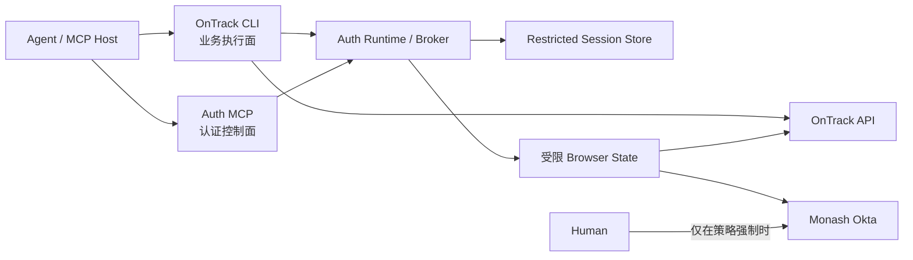
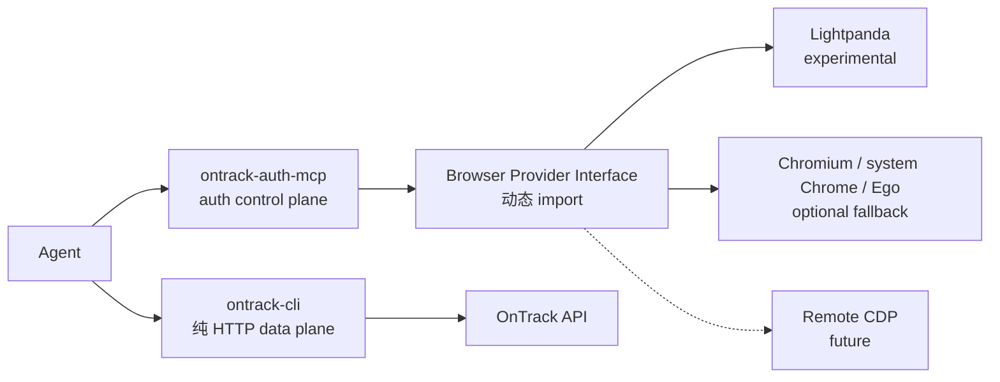

# OnTrack CLI Agent-Ready 实施计划

状态：0.5.0 发布候选验证中；Lightpanda 保持为后续实验项
分支：`codex/agent-ready-runtime`
协议目标：`ontrack.agent/v1`

## 1. 产品定位

OnTrack CLI 的主要调用方是 Agent，人类终端体验是同一执行能力之上的可选渲染层。

Agent 不应：

- 解析面向人的日志、表格或错误句子；
- 主动判断何时登录、刷新或重新运行登录命令；
- 接触密码、Okta challenge、浏览器 cookie 或 OnTrack token；
- 在网络结果未知时自动重放写请求；
- 依赖交互式 stdin、颜色、spinner 或选择菜单；
- 猜测命令参数、响应字段或错误是否可重试。

Agent 应获得：

- 版本化、可发现、Schema-first 的命令协议；
- 调用业务命令时自动完成认证可用性检查；
- Token 即将过期时的静默续期；
- Monash 强制验证时的结构化 human handoff；
- 稳定错误码、退出码和下一步动作；
- dry-run、确认、幂等与 unknown-outcome 保护；
- 对流式事件、输出边界和上下文成本的明确控制。

## 2. 核心架构



业务命令是 data plane。Auth MCP 是 control plane，只负责：

- `auth.status`
- `auth.ensure`
- `auth.logout`

Auth MCP 不提供 OnTrack 业务工具，不向 Agent 返回 Token、cookie、SSO URL 或认证表单数据。

## 3. 不变量

1. Agent 模式 stdout 只包含一个协议响应；诊断信息进入 stderr。
2. 现有裸 `--json` 在兼容期内保持原始 shape；Agent 协议使用 `--output agent-json`。
3. 所有 authenticated command 在业务请求前调用统一 Auth Runtime。
4. 同一 session 在同一时刻最多有一个 refresh 或 interactive login。
5. 锁内必须重新读取 session；其他进程已完成刷新时直接复用。
6. Session 使用同目录临时文件、`0600` 权限和原子 rename 写入。
7. 401/419 只由 Auth Runtime 分类；业务 Module 不自行循环刷新。
8. 只读请求在明确安全时最多重放一次；写请求绝不自动重放。
9. Refresh Cookie 继续保存在 exact-origin、`0600` 的 browser state 中，不复制到模型输出。
10. 普通 ping 不被视作延长会话；只在 TTL gate 或认证失败时续期。
11. 所有写操作默认 dry-run；真实写需要显式确认。
12. 相同 idempotency key 的未知写结果禁止再次 dispatch。
13. 任意成功、错误、fixture、日志和协议输出都不得包含 credential。
14. 核心 CLI 的正常命令不得加载浏览器 provider，也不得要求服务器安装 Chromium。
15. 执行日志锁不得自动抢占；遗留锁必须先核对远端状态和本地 journal，再由运维显式处理。

## 4. Agent 协议

### 4.1 成功响应

```json
{
  "schema_version": "ontrack.agent/v1",
  "request_id": "req_...",
  "command": "projects.list",
  "status": "success",
  "summary": "Command completed successfully.",
  "data": {},
  "warnings": [],
  "next_actions": [],
  "artifacts": []
}
```

### 4.2 错误与暂停响应

```json
{
  "schema_version": "ontrack.agent/v1",
  "request_id": "req_...",
  "command": "projects.list",
  "status": "auth_required",
  "summary": "Monash authentication requires human verification.",
  "error": {
    "code": "HUMAN_VERIFICATION_REQUIRED",
    "retryable": true
  },
  "next_actions": [
    {
      "action": "auth.ensure",
      "arguments": {
        "interaction": "if_required"
      }
    }
  ],
  "artifacts": []
}
```

稳定错误码至少包括：

- `INVALID_ARGUMENT`
- `AUTH_REQUIRED`
- `HUMAN_VERIFICATION_REQUIRED`
- `AUTH_REFRESH_FAILED`
- `FORBIDDEN`
- `NOT_FOUND`
- `CONFLICT`
- `RATE_LIMITED`
- `REMOTE_UNAVAILABLE`
- `CONFIRMATION_REQUIRED`
- `IDEMPOTENCY_OUTCOME_UNKNOWN`
- `INTERNAL_ERROR`

退出码：

| Exit | 含义                             |
| ---: | -------------------------------- |
|    0 | success                          |
|    2 | invalid argument / usage         |
|    3 | auth or human handoff required   |
|    4 | forbidden                        |
|    5 | not found                        |
|    6 | conflict / confirmation required |
|    7 | retryable remote failure         |
|    8 | unknown write outcome            |
|   10 | internal failure                 |

## 5. 认证状态机

`auth.ensure({ min_ttl_seconds, interaction })`：

1. 读取本地 session。
2. 没有 session：尝试现有受限 browser state；否则返回 `AUTH_REQUIRED`。
3. Token 剩余时间大于 margin：返回 `ready`，不访问网络。
4. Token 即将过期或已过期：进入 single-flight。
5. 获取跨进程锁后重新读取 session。
6. 若其他进程已经刷新：复用新 session。
7. 使用 exact-origin browser state 触发 `/api/auth/access-token`。
8. 验证 `auth_token_expiry` 后原子保存新 session。
9. 静默刷新失败且 `interaction=never`：返回 `HUMAN_VERIFICATION_REQUIRED`。
10. `interaction=if_required`：只允许打开受控可见浏览器，让用户完成 Monash 页面上的必要操作。
11. 成功后自动保存、释放锁并恢复调用方。
12. 任意失败路径释放锁；不得重试循环或清空仍可诊断的旧 session。

首个版本不承诺绕过 Okta 策略。目标是把 number challenge 降低为：

- 已有 OnTrack Refresh Cookie：零次；
- Refresh Cookie 失效但 Okta SSO Session 有效：零次；
- Monash 策略强制重验：一次。

## 6. 服务器轻量化与 Lightpanda 本地 Spike

### 6.1 上游约束与承诺边界

当前不假设 Monash/OnTrack 会提供 service app、Native OIDC、CIBA、Direct Auth
或正式的 CLI token exchange。Auth MCP 是认证控制面，可以协调已有 session、刷新和
human handoff，但不能创造上游不存在的认证能力。

因此不承诺同时满足以下三个条件：

1. 完全不使用浏览器；
2. 始终代表真实学生身份；
3. 凭证永久无人值守。

硬凭证失效或 Monash 策略强制验证时，稳定返回
`AUTH_REAUTH_REQUIRED`/`human_action_required`，不得无限重试，也不得用定时 ping
伪造永久登录态。

### 6.2 目标包与运行边界



- `ontrack-cli`：保持纯 HTTP 核心；默认 npm 安装不携带浏览器二进制。
- `ontrack-auth-mcp`：只暴露 `auth.status`、`auth.ensure`、`auth.logout`，Token 和
  Cookie 永不返回给 LLM。
- 浏览器能力通过 provider abstraction 隔离，候选为 Lightpanda（experimental）、
  Chromium/system executable（fallback）和未来 remote CDP。Lightpanda 只能在同时设置
  `ONTRACK_BROWSER=lightpanda`、`ONTRACK_EXPERIMENTAL_LIGHTPANDA=1`、绝对
  `ONTRACK_LIGHTPANDA_PATH` 且运行 Bun `>=1.4.0` 时显式选择；不从 `PATH` 自动发现。
- provider 只允许动态 import；`capabilities`、`schema` 及已认证的普通业务命令不得
  初始化 Playwright/CDP 或浏览器进程。
- 服务器默认不安装 Chromium。Lightpanda 未通过实验门禁前不得成为生产默认路径。
- 后续将 browser bootstrap 从核心包边界拆为可选 provider；`playwright-core`
  本身不是主要体积来源，但也不得被正常命令 eager-load。
- Lightpanda provider 使用最小化子进程环境与 OS 分配的 loopback CDP endpoint；连接前
  验证受信任二进制、loopback host 和 child-reported OS-assigned port。当前
  Lightpanda CDP 没有客户端认证，无法证明 peer ownership，因此真实鉴权必须 fail
  closed，只允许 credential-free public-page spike。
- interactive capture、silent stored-state probe 与 provider startup 共享 hard deadline；
  normal HTTP 命令不会加载 Playwright 或任何 browser provider。

当前本机基线：

| 项目                           |    观测值 |
| ------------------------------ | --------: |
| `playwright-core`              | 约 9.6 MB |
| Playwright full Chromium cache | 约 344 MB |
| `chromium_headless_shell`      | 约 192 MB |
| 普通 `capabilities` 命令       | 约 0.02 s |

### 6.3 第一优先级：纯 HTTP Refresh Cookie 验证

先验证已保存的 OnTrack exact-origin refresh cookie 能否由 Bun `fetch` 直接：

1. POST `/api/auth/access-token`；
2. 获得新的 `Auth-Token` 与可信 expiry；
3. 使用所得 Token 只读 GET `/projects`；
4. 将新 session 原子保存到受限本地 store。

若验证成功，服务器日常路径完全使用 HTTP，浏览器只负责低频 bootstrap。若失败，
才评估由 Lightpanda 承担服务器端低频重新认证；不通过周期性 ping/轮询尝试无限续命。

### 6.4 Lightpanda 实验范围

实验只使用由绝对 `ONTRACK_LIGHTPANDA_PATH` 指定的、本地或自托管且已审核的
Lightpanda 二进制；不从 `PATH` 自动发现。Lightpanda Cloud 不接触真实 Monash 凭证。
在 authenticated CDP transport 可用前，实验不得使用测试账号或任何真实凭证，只逐项记录
公共登录页面的兼容性：

1. Monash SSO 初始重定向；
2. Cookie、SameSite 和 exact-origin 行为；
3. 页面 JavaScript 与导航；
4. Okta 表单加载兼容性。

表单提交、Okta Verify/number challenge、返回 OnTrack、捕获
`POST /api/auth/access-token` 与只读 `GET /projects` 暂时全部标记为 blocked，而不是
“未测试即通过”。只有在 CDP 提供 auth token、继承 listener FD、受权限保护的 Unix
socket 或同等 peer-ownership 保证后，才允许继续这些凭证步骤。

绝不在 spike 中调用 submission、plan、logout 或其他写/破坏性接口。每一步记录：

- 兼容/不兼容与可复现失败原因；
- 冷启动和暖启动耗时；
- 峰值 RSS；
- 二进制与运行依赖安装体积；
- CDP/Playwright 能力缺口；
- 凭证是否始终留在受限进程与本地 store。

2026-08-01 本地 credential-free 结果：Lightpanda nightly
`1.0.0-nightly.8450+392bb4c7` 可通过 Playwright CDP 到达真实
`https://monashuni.okta.com`，执行页面 JavaScript，读取 2 个公共登录 cookie，并在约
2.5 秒后观察到 `identifier` 输入框。早期 credential-free auth-loop probe 的 10 秒
deadline 在 10.61 秒退出；启用 credential fail-closed 后，真实 `login` 在 0.57 秒、
启动 Lightpanda 前拒绝。两条路径均无残留进程。该结果只证明公共页面/CDP 基础兼容，
不证明真实 OnTrack 鉴权可用。
结果可由三重环境门禁后的 `bun run spike:lightpanda` 复现；该 harness 只返回
origin、input/cookie 数量和 identifier-present 布尔值，不暴露 raw Browser、DOM 或
cookie value。

### 6.5 失败策略与实验门禁

Lightpanda 的 Web APIs/CDP 仍在演进，因此只能作为 experimental provider。升级为
可选 server provider 前必须同时通过：

- authenticated transport 或等价的 peer-ownership guarantee；
- 完整只读认证矩阵；
- 无 credential 泄漏的安全审查；
- session/refresh 并发与崩溃恢复测试；
- 相比 Chromium 有明确的启动、RSS 和安装体积收益；
- 连续多次真实环境 smoke 无协议漂移。

当前 CLI 在 Lightpanda plan 到达任何 saved cookie、用户名、密码、MFA 或 token 前即
返回稳定 `browser_unavailable`；macOS/Linux 之外也 fail closed。即使未来通过上述门禁，
Lightpanda 仍须保留为显式 opt-in，不成为服务器默认值；任何版本、信任、CDP、context
隔离或 deadline 失败都不得降级到未验证浏览器或无限登录循环。

若 Lightpanda 不兼容 Okta：

- 不使用 jsdom/happy-dom 冒充完整浏览器；
- 不逆向依赖脆弱的私有 IDX 流程；
- 保留 `chromium-headless-shell`、system Chrome 或 Ego 作为可选兼容 fallback；
- fallback 从核心 npm 默认依赖中拆离；
- 硬失效返回稳定的 human handoff，不自动回退成无限登录循环。

这项 spike 是 0.5.0 之后的隔离实验，不削弱当前 Agent protocol、Auth Broker、
幂等写操作、测试、PR 和发布门禁。

## 7. 命令发现与输入

新增离线 command registry，记录：

- 稳定 command path；
- read/write 风险；
- 是否需要认证；
- 是否可能需要 human interaction；
- 输入/输出 JSON Schema；
- confirmation 与 idempotency policy；
- 是否 streaming。

发现命令：

```bash
ontrack capabilities --output agent-json
ontrack schema task.show --output agent-json
```

结构化输入：

```bash
ontrack task show \
  --input-json '{"project_id":87,"task_definition_id":501}' \
  --output agent-json
```

```bash
printf '%s' '{"project_id":87,"task_definition_id":501}' |
  ontrack task show --input - --output agent-json
```

约束：

- stdin 必须是非 TTY；
- 输入有固定大小上限；
- 只接受 JSON object；
- 拒绝 prototype-pollution key；
- 同一字段不得同时由 JSON 和显式 flag 提供；
- Command registry 明确字段到 flag 的映射，不接受任意 catch-all 参数。

## 8. 写操作

写操作采用 preview/apply 语义：

1. 不带 `--confirm` 时验证前置条件并输出不含路径/凭证的 dry-run preview。
2. Agent apply 需要显式 `--confirm` 和稳定 `idempotency_key`。
3. journal 用 command + canonical input 生成 semantic fingerprint。
4. journal 在 dispatch 前原子记录 `in_progress`。
5. server 明确成功且 read-back 完成后记录 `succeeded` 和安全结果。
6. server 明确拒绝后记录 `rejected`，允许相同输入重新尝试。
7. transport 或进程中断无法证明结果时保持 `outcome_unknown`/`in_progress`，
   禁止相同 key 再次发送。
8. 已成功 key 直接重放本地安全结果；同 key 不同输入返回 `CONFLICT`。
9. 不向 OnTrack 发送未经服务器合同验证的虚假 `Idempotency-Key` header。

第一批接入：

- `plan set-dates`
- `plan reset`
- `submission upload`
- `submission upload-new-files`

## 9. 实施阶段

### Phase A：协议基础

状态：完成。

- 新增 Agent envelope、稳定错误码和退出码。
- 新增 command registry、capabilities、schema。
- 新增 `--output agent-json`。
- 保持现有 `--json` 兼容。
- 新增严格 JSON stdin/input-json。

退出条件：离线命令发现可用；Agent 模式成功和失败均为单一结构化输出。

### Phase B：Auth Runtime

状态：完成。

- Session 原子写入。
- 同进程 promise single-flight。
- 跨进程 refresh lock、owner 验证与 timeout。
- Expiry margin。
- 受限 browser-state 静默刷新 Adapter。
- `interaction=never|if_required`。
- 所有 authenticated commands 使用统一 ensure。

退出条件：两个并发进程只执行一次刷新；进程崩溃不产生半写 session。

### Phase C：Auth MCP

状态：完成。

- 增加本地 stdio MCP server。
- 只注册 auth control-plane tools。
- 工具返回 `structuredContent` 和安全文本摘要。
- 使用 MCP tool annotations 标注 read-only、destructive、idempotent。
- stdout 只承载 MCP framing，日志进入 stderr。

退出条件：MCP Inspector 可调用 status/ensure/logout；所有返回不含 credential。

### Phase D：业务命令 Agent 化

状态：完成。

- 全部 read command 接入 Agent envelope。
- watch/feedback watch 使用 NDJSON envelope frame。
- 对结构化输入设置 64 KiB 边界，输出统一执行 credential sanitization。
- 人类模式继续使用表格和面板。

退出条件：Agent 不需要解析人类文本或读取 stderr 才能完成读取任务。

### Phase E：写操作安全

状态：完成。

- dry-run preview 作为可审计 prepare 结果，引入 execution journal。
- 写命令要求 confirmation/idempotency。
- unknown outcome 可恢复且不可误重试。
- crash-after-success 场景有持久结果。

退出条件：并发 Agent 和进程重试不会重复提交已知或未知写操作。

### Phase F：验证与发布

状态：实现与本地验证进行收尾；PR、CI、npm 与 GitHub Release 由发布步骤完成。

- Unit、integration、stub E2E、MCP transport tests。
- 全仓 line/function coverage 持续不低于 80%。
- typecheck、build、Bun audit、package verification。
- 只读真实环境 smoke：silent ensure + projects。
- 安全审查和最终代码审查。
- Conventional commit、PR、CI、合并。
- 按版本策略发布 npm 和 GitHub Release。

### Phase G：Lightpanda 隔离实验

状态：已纳入计划，尚未声明兼容或启用生产路径。

- 建立 browser provider abstraction 与可选包边界。
- 先完成 Bun HTTP refresh-cookie spike。
- 再按 6.4 的只读矩阵测试本地/自托管 Lightpanda。
- 对照 Chromium fallback 记录性能、体积和兼容性。
- 通过门禁后才允许显式选择 server provider，仍不设为无条件默认值。

退出条件：有可复现实验报告、逐步证据和明确 go/no-go 决策；核心命令的纯 HTTP
轻量路径保持不变。

## 10. 测试矩阵

- 有效 session：零网络刷新。
- 即将过期：提前刷新一次。
- 两个同进程 ensure：一个 refresh。
- 两个跨进程 ensure：一个 refresh。
- execution lock 已存在（包括 dead owner）：fail closed，禁止自动抢占。
- lock timeout：结构化 retryable error。
- refresh 成功：原子保存，新旧文件都不会半写。
- refresh 失败：旧 session 不被空值覆盖。
- `interaction=never`：绝不读取 stdin 或打开人工流程。
- `interaction=if_required`：最多一个可见浏览器 flow。
- 401/419 read：最多 refresh + replay 一次。
- 401/419 write：不 replay。
- Agent stdout：一个合法 JSON envelope。
- 现有 `--json`：保持兼容。
- JSON stdin：大小、类型、重复字段和危险 key 均验证。
- MCP：listTools、callTool、错误、shutdown、secret regression。
- 写 journal：succeeded replay、unknown refusal、semantic hash conflict。
- 包内容：包含 CLI 和 Auth MCP 两个 bin，不包含源码外敏感文件。
- 浏览器 provider：普通命令不加载，实验仅调用认证与 GET `/projects`。

## 11. 发布判断

这次改造改变的是产品执行协议，计划作为 `0.5.0` 发布：

- `0.4.x` 保持当前业务合同；
- `0.5.0` 增加 Agent 协议和 Auth MCP；
- 现有裸 `--json` 不在 `0.5.0` 中破坏；
- 若未来让 envelope 成为 `--json` 默认 shape，再进入新的 breaking 版本。
