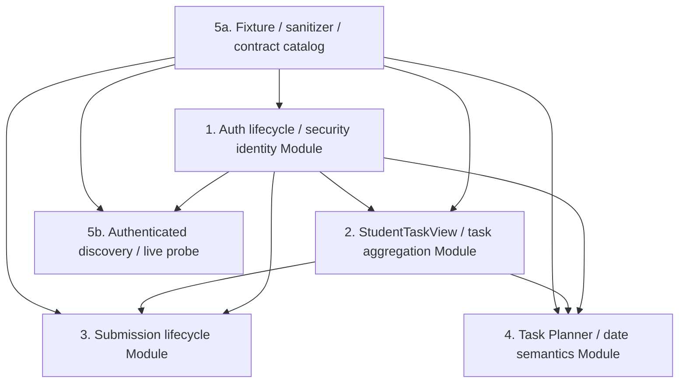

# OnTrack CLI 架构重构计划（仅计划，2026-07-31）

> 本文只记录重构计划，不实施业务逻辑，不冻结 TypeScript 签名，不引入新的运行时行为。所有具体 **Interface** 都是需要先通过的决策门；任一前序决策门未通过，不得开始其后的 **Implementation**。

## 1. 目标、术语与约束

### 1.1 重构目标

生产 OnTrack 已从“project 中有 task 列表、一次上传、一个 due date、静态 token 缓存”的模型，演变为学生工作台：任务目录来自 unit task definitions，任务可见性受目标成绩、tutorial、前置条件和个人计划影响；submission 是有临时状态与取消补偿的生命周期；日期有多种语义；浏览器会话会换取短期 credential。

本计划将这些规则集中到五个深层 **Module**：

1. Auth lifecycle / security identity Module
2. StudentTaskView / task aggregation Module
3. Submission lifecycle Module
4. Task Planner / date semantics Module
5. Production contract discovery + fixture Module

目标不是增加抽象层数量，而是提高每个 Module 的 **Depth**：调用方以较小的 **Interface** 获得大量一致的行为。由此提高调用方的 **Leverage**，并把规则、缺陷与验证集中到较少位置，获得 **Locality**。

### 1.2 强制术语

- **Module**：有 Interface 与 Implementation 的代码或切片。
- **Interface**：调用方正确使用 Module 所需了解的全部事实，包括类型、前置条件、错误模式、顺序、配置和性能。
- **Implementation**：Module 内部代码。
- **Depth**：调用方通过小 Interface 获得多少行为。
- **Seam**：可以改变行为而不在原地编辑的地方。
- **Adapter**：在一个 Seam 上满足 Interface 的具体实现。
- **Leverage**：Depth 带给调用方的能力收益。
- **Locality**：Depth 带给维护者的规则与问题集中度。

不得把“先建一个 interface 以备将来替换”当成理由。一个 Adapter 只能说明假设的 Seam；至少有两个真实变体时，Seam 才是已验证的需求。

### 1.3 不变量

1. 所有真实环境写操作默认 dry-run；只有用户明确确认、合同已验证且操作可解释时才可执行。
2. 任意 fixture、日志、错误、JSON 输出或文档不得包含 token、cookie、密码、完整浏览器 storage、个人身份资料或真实作业文件。
3. Adapter 不得读取全局 session、环境隐式 credential 或 CLI 全局状态；credential、clock、HTTP transport、文件读取等依赖必须通过所属 Module 的 Interface 明确提供。
4. 419 只能在 Auth Module 集中解释。业务 Module 不得各自重试、刷新或吞掉 419。
5. task instance identity 与 task definition identity 必须显式区分；禁止“遇到哪个 id 都算”的 fallback。
6. 所有日期值必须拥有日期语义、来源与时区解释；禁止继续将所有值压扁为 `due`。
7. `bun test`、typecheck、build、fixture 驱动的 integration、stub E2E 需要通过；总覆盖率在 M2 前达到并持续不低于 80%。

## 2. 现状证据与架构判断

### 2.1 真实环境证据

来源：[ONTRACK_PRODUCTION_AUDIT_2026-07-31.md](./ONTRACK_PRODUCTION_AUDIT_2026-07-31.md)。

- 两个已检查 project 的 `project.tasks` 都为空，而 Web 分别显示 11 和 10 个学生任务；对应 unit 分别有 18 和 22 个 `task_definitions`。
- 浏览器前端通过 `POST /api/auth/access-token` 获得 `user`、`auth_token`、`auth_token_expiry`；旧 CLI cached session 请求生产得到 419。
- submission 打开向导时可临时进入 `Ready for Feedback`，Cancel Submission 后恢复原状态；upload requirements 是独立 evidence slot，submission details 还包含 `has_pdf` 与 `processing_pdf`。
- 任务存在 unit default start/target/feedback deadline、student personal start/target，以及 Save Dates / Reset To Unit Default。
- 已确认或被前端发现的读取合同包括 project detail、unit detail、prerequisites、engagements、submission details、webcal；其中动态字符串拼接使仅靠 bundle literal 正则的发现不完整。

### 2.2 当前源码中的耦合

| 位置 | 证据 | 造成的问题 |
|---|---|---|
| `src/cli.ts`（3,368 行） | `loadProjectsWithTaskMetadata`、`flattenTasks`、上传、watch、日期呈现和命令渲染都在同一文件 | 领域规则没有 Locality，调用方直接理解 raw payload。 |
| `src/lib/types.ts` | `ProjectSummary`、`TaskSummary` 大量 optional 字段与 `[key: string]: unknown` | raw transport shape 与领域语义混杂，Interface 没有表达 identity 和状态不确定性。 |
| `loadProjectsWithTaskMetadata` | 仅用 unit definition 丰富现有 `project.tasks` | 当 `project.tasks=[]` 时仍得到空任务列表，违反生产事实。 |
| `getTaskDefinitionId` / selector | 最后 fallback 到 `task.id`；selector 同时按 instance id 与 definition id 匹配 | 会把两种 identity 混为一谈。 |
| `handleSubmissionUpload` | selector、slot mapping、文件读取、multipart、trigger、comment、输出在同一函数 | submission 没有独立 lifecycle Interface，也无法表达 begin/cancel/unknown outcome。 |
| `WatchTaskState.dueDate` | 一个 `dueDate` 和 `due_changed` 事件 | 不足以表达 personal/default/feedback 的日期语义。 |
| `discovery.ts` | literal regex + 第一项目第一任务来 materialize probe context | 动态 route 漏抓，`project.tasks=[]` 时没有 task context。 |
| `session.ts` / `auto-login.ts` / `cli.ts` | session 无 expiry/source；认证逻辑分散 | 419、refresh、注销和 secret handling 不能集中验证。 |

## 3. 依赖图、顺序与可并行项



Module 5 在依赖上必须拆成两层，避免与 Auth 环依赖：**5a fixture/sanitizer/catalog** 零 credential，可先于 Auth；**5b 已认证 capture/probe** 只消费 Auth Module 已验证的 credential context，不得自己读 global session 或浏览器 profile。图中的业务 Module 若发起 HTTP，也只接受经 Auth 注入的 credential context。

### 3.1 推荐里程碑

| 里程碑 | 范围 | 进入条件 | 退出条件 |
|---|---|---|---|
| M0 | 5a 的 fixture/sanitizer；1 的 credential 生命周期建模 | 无 | 脱敏 fixture 能表达空 tasks 与非空 task definitions；不接真实写操作；5b live probe 不得在 Auth Interface 决策门通过前开工。 |
| M1 | 1 的只读认证生命周期；2 的只读 StudentTaskView | M0 关键合同通过 | `tasks` / `task show` 可在空 project tasks 情况下工作。 |
| M2 | 4 的 read-only planner；3 的 read-only submission status/PDF processing；watch 迁移 | M1 | 日期语义冻结，coverage 达到 80%。 |
| M3 | 4 的 set/reset 与 3 的 transactional write | M2 且写合同已逐项验证 | 默认 dry-run、确认、read-after-write、补偿结果全部可见。 |
| M4 | 删除旧 Implementation | M3 | raw project task fallback、单 due 模型、one-shot upload、旧登录主路径不再被默认调用。 |
| M5 | Portfolio/Tutorial/Groups/Calendar/Engagement | M4 | 高级功能只消费已稳定的 StudentTaskView 与 Planner Module。 |

### 3.2 可并行项

- M0 中，fixture sanitizer/catalog 与 Auth 的领域表示可并行；两者都不得假定未验证的 access-token 请求细节。
- M1 后，Submission 的只读 status 轨道与 Planner 的只读 date semantics 轨道可并行。
- 写操作不能并行提前：Submission begin/cancel/commit 与 Planner set/reset 各自需要完整的真实写合同和补偿/恢复方案。
- 每个 Module 的测试可并行写，但任何 Module 的 production verification 必须串行、低频，并遵守 read-only 或用户确认限制。

## 4. Module 1：Auth lifecycle / security identity

### 4.1 证据与当前耦合

- 生产使用 `/auth/access-token` 返回 expiry；当前 `OnTrackApiClient.signIn` 仍调用 `/auth`，`SessionData` 没有 expiry 或 credential source。
- `handleLogin` 直接组装 `remember: true`、直接写 session；`requireSession` 只检查文件是否存在。
- browser SSO capture、browser state 读写、HTTP sign-in、local session、whoami projection 分布在 `auto-login.ts`、`session.ts`、`utils.ts`、`whoami.ts`、`cli.ts`。
- `handleLogout` 的 `DELETE /auth` 未带已确认的 `remember` 语义，真实环境返回过 `400 remember is missing`。
- 已完成的浏览器 origin 过滤、0700/0600 文件权限、secret redaction 与 whoami allowlist 是基础，但还未组成一个深层 Module。

### 4.2 目标责任与 Depth

Auth lifecycle / security identity Module 负责 credential 的来源、保存、expiry、刷新、419/401 分类、local revoke、remote signout 以及 identity projection 的 secret exclusion。

该 Module 不负责 SSO 页面 selector、CLI panel 文本或普通领域请求。它应使每个 authenticated caller 只需请求“可用身份”，就获得有效期检查、必要换票、统一失效结果和安全输出规则。这是它的 Depth 与调用方 Leverage。

### 4.3 Interface 决策门（不冻结签名）

在以下问题都有记录的真实合同或 fixture 前，不得写新的 Auth Implementation：

1. `/auth/access-token` 的请求认证前提：cookie、CSRF、header、body、method、成功/失败 status。
2. `auth_token_expiry` 的格式、时区、容忍 clock skew 和 refresh margin。
3. 401、419、网络失败、access-token 被拒绝各自的语义；尤其 419 是否清除本地 credential、是否应尝试一次 refresh。
4. Browser SSO Adapter 应交付浏览器会话证明还是 token；优先前者，避免 token 在 browser Module 外泄。
5. remote signout 的 `remember` 与其他 required 字段；remote signout 失败时 local revoke 的行为。
6. legacy redirect URL 的兼容窗口和显示的弃用/安全提示。

Interface 只能暴露“获得可用身份”“判断/报告身份状态”“本地注销”“已确认的远端注销”；调用方不应知道 token 字段、storage key、browser path 或 refresh endpoint。

### 4.4 Seam 与 Adapter

- **Browser SSO Adapter**：在受控 OnTrack origin 中取得浏览器会话证明；不得复制完整系统 profile。
- **OnTrack auth HTTP Adapter**：执行已经 fixture/真实环境证实的换票和注销合同。
- **Restricted local credential Adapter**：读取、迁移、写入权限受限的 local credential。
- **Clock Adapter**：仅在 expiry 的 unit test 确实需要可替换时间时建立；否则保持内部 Implementation。
- **Identity projection Module**：延续 allowlist，把可展示身份从 credential 中分离。

所有 Adapter 都通过 Auth Module Interface 接收 credential context，禁止直接 `loadSession()` 或读 `process.env` 的全局 credential。

### 4.5 可删除的 Implementation

- 将 redirect query token 或 localStorage 视为常态认证来源的流程；可保留为明确 opt-in 的最后备援。
- 无 expiry/source/refresh time 的平面 `SessionData` 认证表示。
- `handleLogin` 内重复的 session 构造与 `remember: true` 直写。
- “本地文件存在即认证有效”的 `requireSession` 规则。
- 未确认合同的 `DELETE /auth` 远端注销调用。

### 4.6 迁移与验证

1. 用安全的 browser capture 记录 access-token 与 signout 的脱敏 request/response shape；只读观察，不执行破坏性 remote signout。
2. 先写 fixture：有效、即将过期、已过期、419、401、remote logout 400、legacy session。
3. 引入 credential lifecycle 数据模型与旧 local session migration Adapter；新旧持久化并存读取，只有新格式写入。
4. 将所有 authenticated command 改经 Auth Module 取得可用身份；业务 Module 不得捕获并重试 419。
5. 加入新换票流程作为 default；legacy redirect 仅显式启用。
6. remote signout 合同被真实验证后才接入；最后删除旧主路径。

测试：

- Unit：expiry 边界、clock skew、419/401 分类、redaction、legacy migration、损坏 browser state。
- Integration：auth HTTP Adapter 的 request shape、拒绝响应、输出永不含 secret。
- E2E：隔离 browser state 登录、重启后的 refresh/relogin、过期 credential、local revoke。
- 真实环境：只做 login/refresh + 一个只读 projects 请求；remote signout 单独授权后再验证。

### 4.7 回滚、风险、验收与 deletion test

- 回滚：短期允许以 feature flag 回退至旧登录路径，但输出必须标为不保证生产兼容；local credential schema 必须向后读取。
- 风险：错误 refresh 可能形成请求循环；凭据泄漏；错误清理导致用户需重登。控制方法是一个 Auth Module 内的 single-flight/一次性 refresh policy、输出 allowlist、每次失败可行动提示。
- 验收：业务 Module 不得自行解释或重试 419；Auth Module 仅按已通过的决策门 3 处理（直接失效，或 single-flight 至多一次 refresh 后再失效），然后停止业务请求并引导重登；全部输出无 secret；remote signout 只有合同确认后才称成功；调用方不知 credential source。
- **Deletion test**：删除该 Module 后，CLI commands、browser capture、session persistence、HTTP adapter、whoami projection 至少五处会重新实现 expiry/419/redaction/source 规则，复杂性显著重现，因此该 Module 有真实 Depth。

## 5. Module 2：StudentTaskView / task aggregation

### 5.1 证据与当前耦合

- 生产事实是 `project.tasks=[]` 且 `unit.task_definitions` 非空；这个 fixture 必须是本 Module 的第一个 fixture，不是以后补的 edge case。
- `loadProjectsWithTaskMetadata` 只 enrich 既有 tasks；`flattenTasks` 直接展开 `(project.tasks || [])`。
- `getTaskDefinitionId` fallback 到 `task.id`，`findTaskById` 同时按 instance id 和 definition id 找任务。
- `tasks`、`unit tasks`、`task show`、feedback、PDF、submission、watch 均消费该错误聚合路径。

### 5.2 目标责任与 Depth

StudentTaskView Module 是“某学生在某 project 中可见、可选择、可执行何种任务”的唯一只读来源。它聚合：

```text
unit.task_definitions
+ project.tasks（可为空）
+ project.target_grade
+ project.tutorial_enrolments
+ unit.tutorial_streams
+ prerequisite 数据
+ personal target dates
+ unit policy
```

它明确区分 project、task definition、task instance identity，表达 definition exists、not instantiated、working、submitted/processing、awaiting feedback、discuss、complete 等可解释状态。

调用方获得一个稳定学生任务视图和稳定任务引用，不再手动 merge raw payload；这给 tasks、selectors、PDF、feedback、watch、planner、submission 带来高 Leverage。

### 5.3 Interface 决策门（不冻结签名）

1. 动态 grade definition 的排序与比较（含非标准等级如 4K）。
2. tutorial stream 对任务可见性影响的真实规则。
3. 空 `project.tasks` 的精确定义：无 instance、延迟加载、权限限制或其他状态。
4. task definition id 的作用域及跨 project/跨 unit 重用情况。
5. 未实例化 task 的 status、可下载/可反馈/可提交能力。
6. portfolio-only、SCORM、assessment-only、discussion-required task 的 selector 规则。
7. abbreviation 的唯一范围与歧义 UX。

任何前序决策门未通过时，只能输出 unknown/unsupported，不得猜测或 fallback 到另一种 id。

### 5.4 Seam 与 Adapter

- **Project read Adapter**：读取 summary/detail。
- **Unit catalog Adapter**：读取 task definitions、grade policy、tutorial 信息。
- **Task-instance Adapter**：读取已存在 instance；其 absence 是领域数据，而不是空列表异常。
- **Eligibility/aggregation Implementation**：pure Implementation，内部可有 private seam 处理 grade/tutorial/prerequisite policy。
- **Legacy task-list Adapter**：短期把旧 `ProjectSummary.tasks` 映射为输入，不让旧 type 继续穿过所有 commands。

除非真实存在 Student 与 Staff 两套不同可见性规则，不建立两套 public Interface。

### 5.5 可删除的 Implementation

- `flattenTasks` 的 raw array 展开。
- `loadProjectsWithTaskMetadata` 中“只 enrich existing instance”的结果模型。
- `getTaskDefinitionId` 对 `task.id` 的 fallback。
- `findTaskById` 的双 identity 猜测。
- `resolveTaskSelector` / `resolveTaskBatchSelector` 对 `project.tasks` 非空的要求。
- 各 CLI command 内重复的 title/abbr/status/date/unit 拼装。

### 5.6 迁移与验证

1. 先建脱敏 fixture：project detail 的 `tasks: []` 与同 unit 非空 task definitions；测试必须先失败，证明旧路径不成立。
2. 写 pure aggregation test：identity、empty instance、grade、tutorial、portfolio-only、unknown status。
3. 建只读 StudentTaskView Implementation；先迁 `tasks --json` 和 `task show --json`。
4. 将 selector 迁到显式 task definition identity；兼容期将旧 `--task-id` 的歧义报错，不静默解释。
5. 迁移 tasks、unit tasks、task show、task PDF、feedback list/watch。
6. 让 Planner/Submission 只接受该 Module 的任务引用。
7. 删除 raw project task 聚合路径。

测试：

- Unit：空 instance、same abbreviation、definition 与 instance id 冲突、dynamic grade、tutorial filtering、partial source failure。
- Integration：Project/Unit Adapter 获取顺序；unit detail 失败不得被显示为“没有任务”。
- E2E：stub server 重放空 tasks fixture 时，`tasks`、`task show --abbr`、task PDF、feedback list 均可工作。
- 真实环境：将两门已审计 unit 的 CLI abbr 集合与 Web UI 比对；差异必须可解释或标为合同未知。

### 5.7 回滚、风险、验收与 deletion test

- 回滚：保留短期 `--legacy-project-tasks` 诊断模式，不作为默认；严重误聚合时可紧急启用并明确说明不完整。
- 风险：错误 grade/tutorial policy 造成错误可见性；identity 混淆导致错误写操作。控制方法是只读先行、explicit identity、write modules 依赖稳定 task reference。
- 验收：`project.tasks=[]` 时仍有正确任务；任务引用绝不混淆 id；调用方不直接读取 `project.tasks`。
- **Deletion test**：删除此 Module 后，tasks、unit tasks、task show、feedback、PDF、submission、watch、planner 至少八类调用方要各自重建 definition/instance/grade/selector 规则，因此它拥有最高优先级的 Depth。

## 6. Module 3：Submission lifecycle

### 6.1 证据与当前耦合

- 真实 UI 表明打开 upload 可以先改变任务状态，Cancel 可以补偿回原状态；temporary state 与 cancel 必须属于同一个 lifecycle Interface。
- 每个 upload requirement 是 evidence slot；还有 review、upload new files、processing PDF。
- `handleSubmissionUpload` 同时处理 selector、slot mapping、file read、multipart、trigger、comment、输出；`uploadTaskSubmission` 返回 `unknown`。
- 当前由 raw task status 推断 trigger，且将 upload 成功后 comment 当成简单后续步骤，不能表达 unknown outcome 或 compensation。

### 6.2 目标责任与 Depth

Submission lifecycle Module 以 submission attempt 为单位，负责：preflight、begin、stage evidence slots、review、commit/trigger、observe、cancel/compensate、PDF processing，以及明确的 `succeeded` / `failed` / `unknown outcome`。

它的 Interface 必须把 temporary transition 和 cancel 放在同一个 lifecycle 中，使调用方能理解“开始后取消”是合法补偿而不是两个无关 HTTP 调用。它不读 stdin，不渲染 CLI，不知道 raw task list。

### 6.3 Interface 决策门（不冻结签名）

1. begin、stage、review、commit、cancel 分别对应哪些真实 HTTP contract，及它们的顺序。
2. 是否有 upload session id、idempotency key 或可用于 network timeout 后查询结果的 correlation id。
3. slot 是全部 required 后才 commit，还是可保存 draft；slot 的 file/type/size policy。
4. cancel 的补偿范围：状态、文件、PDF processing、comment 分别如何处理。
5. upload-new-files 的合法前置状态与是否重新触发 processing。
6. comment 是 attempt 内步骤还是独立 mutation；comment 失败是否需要 compensation。
7. processing 的 poll interval、timeout、terminal failure 与 download-ready 条件。

没有 idempotency contract 时，写请求超时只能报告 unknown outcome，绝不自动 retry。

### 6.4 Seam 与 Adapter

- **Submission HTTP Adapter**：只实现已被 fixture 和真实观察证实的 begin/stage/review/commit/cancel/status/download 合同。
- **Local file Adapter**：只提供已验证文件的 metadata/bytes；不参与状态转换。
- **Task reference Adapter**：接收 StudentTaskView 的明确 definition identity。
- **Clock/polling Adapter**：仅当 deterministic polling test 与真实时间确实形成两个 Adapter 时建立 Seam。
- **CLI confirmation Implementation**：位于 Module 外，将用户确认映射为 lifecycle intent。

Adapter 不得直接读取全局 session；Auth Module 提供已验证 credential context。

### 6.5 可删除的 Implementation

- 一段式 `handleSubmissionUpload` 成功路径。
- `uploadTaskSubmission(): Promise<unknown>` 的无状态结果。
- 从 raw `TaskSummary.status` 推断 write trigger 的隐式规则。
- 只按文件数等于 requirement 数量处理的 `assignUploadFileKeys` 业务决策。
- `pdf submission` 将 HTTP 200 视作 submission 已完成。
- 不检查前置状态的 `upload` / `upload-new-files` 共享流程。

### 6.6 迁移与验证

1. 先完成 submission details fixture 和只读 `submission status` / processing-aware PDF。
2. 写 preflight/dry-run：展示 slot、可执行 action、状态变更风险，但不写入。
3. 用用户批准的可撤销测试任务，从 Ego Lite 获取完整 begin → cancel、begin → stage → commit、upload-new-files 序列的脱敏证据。
4. 实现 attempt journal，区分明确失败与 unknown outcome。journal schema 只保存随机 operation id、枚举状态、时间和非个人化 slot 标识；明确禁止 token/cookie、username/email、原始文件名、文件内容、comment 或其他自由文本。
5. 实现 cancel/compensation，并先验证 cancel 成功、失败与 timeout。
6. 实现 confirmed write；每一步 read-after-write，禁止自动 retry。
7. 合同稳定后才接入 upload-new-files 和 optional comment。
8. 删除旧 one-shot 上传路径。

测试：

- Unit：slot completeness、状态转移、file schema、unknown outcome、polling reduction、compensation decision。
- Integration：slot 2 失败、commit timeout、comment failure、processing 永不结束、cancel 失败；确认写请求无 retry。
- E2E：dry-run → confirm → observe → PDF ready；begin → cancel 后状态恢复。
- 真实环境：只有明确授权的测试任务，逐步人工确认；绝不把正式作业作为 smoke。

### 6.7 回滚、风险、验收与 deletion test

- 回滚：可立即关闭全部 mutation，只保留 status/PDF；journal 用于提示用户 Web UI 手工恢复，不能盲目重发。
- 风险：partial upload、network timeout、临时状态遗留、错误 slot mapping。控制方法是 explicit lifecycle、未知结果、compensation、read-after-write。
- 验收：每次写都有前/后状态；取消能验证恢复；processing 不误报可下载；失败不会称“没有改变”。
- **Deletion test**：删除此 Module 后，upload、upload-new-files、submission PDF、comment、file validation、状态轮询至少六处都要重新实现 transaction/compensation/unknown-result，说明该 Module 具有高 Depth。

## 7. Module 4：Task Planner / date semantics

### 7.1 证据与当前耦合

- 生产有 unit default start/target/feedback deadline、personal start/target、planner Save Dates 与 Reset To Unit Default。
- 已发现 plan、target_dates、reset_target_dates 合同，但尚未逐项确认 write 语义。
- 当前只有 `getTaskDueDate`、`WatchTaskState.dueDate`、`due_changed`、`styleDue`，将不同日期压成一个本机时区的 due。

### 7.2 目标责任与 Depth

Task Planner / date semantics Module 统一负责日期语义、来源、时区、可编辑性、effective display date、prerequisite/dependent timeline 以及 set/reset intent。

本 Module 必须先**冻结日期语义**，才允许任何 plan 写 Implementation：每一个日期至少有 kind、source、timezone interpretation、missing meaning、editability。只有语义冻结后，`tasks`、watch、task show 才能共享同一日期投影，获得 Locality。

### 7.3 Interface 决策门（不冻结签名）

1. 所有 server date-only 与 timestamp 字段、时区和 DST 解释。
2. default / personal / feedback deadline 的 precedence 和 display policy。
3. `target_dates` 是单 task 还是批量、是否原子、返回何种 post-state。
4. `reset_target_dates` 是 project-wide 还是 task-level、可否恢复个人 start date。
5. feedback deadline 是否可编辑、start/target/deadline 的有效顺序。
6. prerequisite graph 的 source of truth、冲突合并、cycle/unknown node。
7. target grade 改变后个人计划和 beyond-target task 的规则。

上述日期语义未完成文档化和 fixture 测试前，禁止写 set/reset Implementation；只能提供 read-only plan view。

### 7.4 Seam 与 Adapter

- **Plan HTTP Adapter**：读取计划和实施已验证的 set/reset。
- **Prerequisite Adapter**：读取 unit-level 或 per-task prerequisite 数据，并报告不一致。
- **Date policy Implementation**：pure Implementation，集中 parse、source、precedence、validation、format preparation。
- **StudentTaskView Adapter**：提供任务目录；Planner 不重新聚合 project/unit/task。

所有 Adapter 使用通过 Auth Module 提供的 credential context，不读取 global session。

### 7.5 可删除的 Implementation

- `getTaskDueDate` 作为唯一业务日期 getter。
- `WatchTaskState.dueDate` 和 `due_changed` 的单日期模型。
- `styleDue` 以本机 midnight 作默认语义的规则。
- `formatDate(getTaskDueDate(task))` 分布式呈现。
- 从 raw due 推断 submission trigger 或 urgency 的规则。

### 7.6 迁移与验证

1. 写 fixture，分别包含 default、personal、feedback deadline、缺失、timezone edge 和 prerequisites。
2. 写日期语义文档与 pure test；达成决策门后才建立 read-only plan view。
3. 新增 `plan show`，先输出所有日期 source；`tasks` 只增加明确列，不立即替换 legacy `due`。
4. 将 watch 迁为 precise date-kind event；兼容期把旧 due event 映射为 effective-date change。
5. 实现 `set-dates --dry-run`、diff 和 validation。
6. 在真实 write 合同通过后，加入 confirmed set 和 reset；每次 read-after-write。
7. 移除模糊 due path。

测试：

- Unit：date-only、timezone、DST、precedence、feedback ordering、invalid interval、target grade change、graph cycle。
- Integration：plan/target/reset contract、server rejection、partial failure、read-after-write。
- E2E：plan show、set dry-run、confirmed set、reset、watch semantic event。
- 真实环境：先只读比对 Web planner；写仅在被授权的可恢复测试任务上执行。

### 7.7 回滚、风险、验收与 deletion test

- 回滚：可独立关闭 Planner write，read-only view 保留；set/reset 前的 snapshot 只用于用户手工恢复指导。
- 风险：日期时区错误、reset scope 错误、prerequisite 误导。控制方法是日期语义先行、dry-run、explicit scope、read-after-write。
- 验收：任何显示日期都有 source 与语义；不再有不透明 due；写操作不跨 project/task。
- **Deletion test**：删除此 Module 后，tasks、watch、task show、set/reset、timeline 至少五处将重建 precedence/timezone/validation，复杂性再次扩散，因此该 Module 具备深度。

## 8. Module 5：Production contract discovery + fixture

### 8.1 证据与当前耦合

- 当前 `discovery.ts` 用 JavaScript literal regex 发现路径；生产大量 route/contract 通过字符串拼接，审计明确指出漏抓。
- `toProbeContext` 依赖 `project.tasks[0]`，与生产 `project.tasks=[]` 冲突。
- 当前 probe 主要是 generic GET，没有 role、side-effect risk、认证前提、观察可信度或 response shape。
- 审计已给出 fixture 候选：access-token、projects summary、空 tasks 的 project detail、非空 task definitions 的 unit detail、prerequisites、submission details、comments、webcal。

### 8.2 目标责任与 Depth

Production contract discovery + fixture Module 将生产观察转成可版本化、可脱敏、可运行的合同证据。它负责 inventory、capture、sanitize、fixture、contract validation 与 drift diff。

它是开发和验证 Module，不是运行时请求的 pass-through。CI 默认只使用 fixture；连接生产只能由 manual、只读、有限预算的操作完成。

### 8.3 Interface 决策门（不冻结签名）

1. fixture 采用最小 shape、完整脱敏 snapshot，还是二者组合；推荐 shape + provenance metadata。
2. 自动 probe 的 HTTP method allowlist 与 request budget；默认 GET/HEAD，禁止写。
3. fixture 的可信等级：bundle discovered、HTTP observed、Student verified、write verified、staff unknown。
4. sanitization 的 PII/secret 字段规则、fixture retention 和 review 流程。
5. sample context 是显式 selector、fixture catalog 还是由 StudentTaskView 提供；禁止“第一项目第一任务”。
6. production drift 是否仅 manual 运行，以及发现 drift 后是否必须人工审核才更新 fixture。

### 8.4 Seam 与 Adapter

- **Browser network capture Adapter**：只监听 allowlisted OnTrack origin；默认拒绝 mutation。
- **Read-only HTTP probe Adapter**：method allowlist、rate limit、request budget、redacted diagnostics。
- **Fixture filesystem Adapter**：保存 shape、schema version、source date、可信等级、sanitization manifest。
- **Contract normalizer Implementation**：保留 field presence/type/enum，移除值和个人数据。
- **Legacy discovery Adapter**：现有 literal regex 作为低可信 signal，不再是事实来源。

5a fixture/sanitizer/catalog Adapter 不接受、不读取任何 production credential。5b live capture/probe Adapter 的 auth context 只能来自 Auth Module Interface，禁止自己读取 global session 或浏览器 profile；因此 5b 不得先于 Auth 决策门与只读认证生命周期实现。

### 8.5 可删除的 Implementation

- `PATH_LITERAL_PATTERN` 是唯一发现来源的假设。
- `toProbeContext` 从 `project.tasks[0]` 推断 context。
- “发现到路径即可 generic GET probe”的假设。
- 无可信等级、role、side-effect risk 的扁平 `ProbeResult`。
- 仅靠人工审计文字维持合同知识的方式。

### 8.6 迁移与验证

1. **第一 fixture（强制）**：project detail `tasks: []` 与同 unit `task_definitions` 非空。该 fixture 是 StudentTaskView 的前置合同，必须先于其他增强 fixture 合入。
2. 为 access-token、projects summary、prerequisites、submission details、comments、webcal 建脱敏 fixture catalog 与 provenance。
3. 先写 sanitizer tests，使用故意包含 token/email/file name 的输入，证明 fixture 和 diff artifact 都无泄漏。
4. 每个 Auth/Task/Submission/Planner HTTP Adapter 都以 fixture 写 contract test；字段缺失、type/enum 漂移必须失败。
5. 将 discovery 扩展为 browser network observed 数据，同时保持 bundle literal 是低可信证据。
6. 将 probe context 改成显式、可审计 selector 或 fixture sample catalog。
7. 建立 manual read-only drift workflow；只生成 diff artifact，人工批准后才更新 fixture。

测试：

- Unit：sanitizer、normalizer、route classification、parameter materialization、no-write allowlist。
- Integration：改变 fixture required field/type/enum 时对应 Adapter 失败。
- E2E：stub server 重放 fixture，跑 Auth read、tasks、planner read、submission status。
- 真实环境：只读低频 capture；禁止 submission/plan write/logout，除非另有明确测试目标与授权。

### 8.7 回滚、风险、验收与 deletion test

- 回滚：fixture 变更独立小 commit，保留旧版本用于 diff；生产 capture 可以完全关闭而不影响 CI。
- 风险：保存 PII/credential、把 bundle 线索误当事实、生产探测造成副作用。控制方法是 sanitizer-first、可信等级、read-only allowlist、manual approval。
- 验收：CI 不需要 production credential；空 tasks/nonempty definitions fixture 全链路通过；每个合同有日期、角色、风险和可信等级；secret scan 为零。
- **Deletion test**：删除此 Module 后，Auth、StudentTaskView、Submission、Planner 会各自维护 mock payload、生产探测、脱敏和 drift 判断，至少四份规则必然漂移，因此它是长期 Locality 的基础。

## 9. 跨 Module 测试、真实环境验证与回滚

### 9.1 测试金字塔

| 层级 | 目标 | 必要覆盖 |
|---|---|---|
| Unit | Module Interface 的确定性规则 | identity、date precedence、state transitions、sanitizer、expiry、redaction。 |
| Fixture integration | Adapter 与 production contract shape 的匹配 | 空 tasks/nonempty definitions、access-token expiry、submission details、prerequisites。 |
| Stub E2E | CLI 调用链是否只穿越深 Module Interface | login/read、tasks/task show、plan show、submission status；后期的 dry-run/confirmed flow。 |
| 真实环境 | 验证已知合同没有漂移 | 默认只读；write 仅用明确测试任务、逐步确认、可恢复。 |

所有新 Module 的测试都应跨越其 public Interface；私有 Implementation 的测试只用于复杂内部 policy，不得让调用方依赖内部 shape。

### 9.2 真实环境操作等级

1. **Level 0：fixture/stub**：无生产连接。
2. **Level 1：匿名 bundle/HTML discovery**：无认证、无写。
3. **Level 2：authenticated read-only**：GET/HEAD、最小 scope、rate budget。
4. **Level 3：reversible write**：用户选择测试任务、dry-run 已验证、明确确认、read-after-write、补偿路径已验证。
5. **Level 4：irreversible write**：不在本计划自动化范围内；必须有新的用户授权与操作 runbook。

### 9.3 回滚原则

- 每个 read Module 与 write Module 独立 feature flag；关闭 write 不应关闭安全的 read view。
- fixture/schema 采用向后可读迁移；不要覆盖或删除旧 session/fixture。
- Submission unknown outcome 时不 retry、不自动 compensate，只记录脱敏 operation journal 和 Web UI 恢复指引。
- Planner set/reset 前记录 before snapshot，但不得将 snapshot 当成未经确认的自动恢复命令。
- Auth 回退路径必须显式显示安全和兼容限制。

## 10. 完成定义

本计划转入实际 Implementation 的条件是：

1. 每一 Module 的所有 Interface 决策门均有已审阅的结论、fixture 或真实观察证据。
2. 第一个 fixture 已明确表达 `project.tasks=[]` 且同一 unit 的 `task_definitions` 非空。
3. 所有 Adapter 都不读 global session 或隐式环境 credential；凡需生产身份的 Adapter（含 5b live probe 与各业务 HTTP Adapter）统一经 Auth Module Interface 注入；5a fixture 路径保持零 credential。
4. 419 处理不扩散到业务 Module；写请求无已证实幂等性时不会 retry。
5. Submission temporary transition 与 cancel 同属一个 lifecycle Interface；Planner 日期语义先冻结再写入。
6. 每项迁移都有 Unit、fixture integration、stub E2E、匹配风险的真实环境验证和 rollback 方案。
7. 删除测试证明每个保留 Module 删除后复杂性会在多个调用方重新出现；否则应删除该 Module 或合并其 Implementation。
8. 总覆盖率至少 80%，无 secret 泄漏，且业务代码改动在独立的后续实施批次进行。
