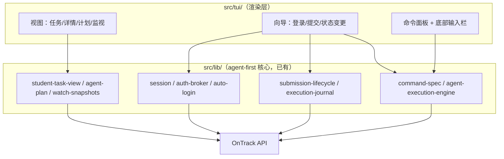

# OnTrack TUI 全面实施计划

状态：TUI 骨架（OpenTUI + React，假数据）已完成并通过 10/10 无头冒烟；本计划覆盖全功能接入
骨架分支：`feat/tui-skeleton`（PR #53）
协议目标：TUI 不引入新业务行为，只做 `src/lib/` 能力的人类渲染层

## 1. 定位与原则

TUI 是 agent-first 核心之上的第二个前端。它与 agent 协议共享同一执行面，
不复制业务逻辑：

- TUI 的每个读视图都来自 `src/lib/` 已有的投影（Student Task View、Plan、
  Watch Snapshot），每个写操作都复用同一命令执行路径（command-spec /
  execution-engine / submission-lifecycle），包括其 preflight、结果验证和
  unknown-outcome 保护。
- TUI 层不包含 API 调用细节、日期优先级规则、提交状态机；它渲染领域投影，
  把用户意图翻译成与 CLI 命令等价的调用。
- Agent 路径（JSON 输出、退出码、错误码）零变化；无参数 `ontrack` 在非 TTY
  下保持现有 welcome 菜单行为。

## 2. 分支与 PR 策略

1. `feat/tui-skeleton`（从 `origin/master` 切出，已完成）— 骨架 + 冒烟测试 +
   AGENTS.md 说明，即 PR #53。
2. 后续每个阶段（见 §4）一个分支一个 PR，叠在 skeleton 合并后的 master 上。
3. 遵循仓库规则：每个 PR 合并前用 `code-review` skill 自审（Standards + Spec
   两轴），全部检查绿才合并。

## 3. 目标架构

数据流：TUI 启动时加载 session，读路径经投影层拉取并规范化；写路径一律
走命令执行面并以其返回的结果为准（例如 Status Trigger 可能被服务器重映射，
UI 显示响应里的最终状态而非乐观值）。

## 4. 分阶段实施

### Phase 0 — 分支整理与骨架 PR

- 按 §2 建 `feat/tui-skeleton`，提交现有骨架（`src/tui/`、
  `scripts/smoke-tui.tsx`、`tsconfig.tui.json`、package/tsconfig 调整、
  AGENTS.md 的 TUI 小节）。
- 验收：CI 绿；`bun run typecheck` 与 `bun run typecheck:tui` 互不干扰；
  `bun test` 453+ 通过；code-review skill 自审通过。

### Phase 1 — 只读数据接入

- 用 `loadSession` + `sessionUsability` 判定登录态；未登录显示登录引导屏
  （代替任务列表）。
- 任务列表/详情接入 `resolveStudentTaskViews` / `buildStudentTaskRows` 投影；
  多 unit 时在顶栏加 unit 切换（`agent-projects` / `agent-units` 数据）。
- 详情面板补充 `agentTaskShowOutput` 的完整字段：Effective Date 及其来源、
  前置任务（`agentTaskPrerequisites`）、资源/任务 PDF 下载入口
  （`agent-task-pdf`，落到 `downloads/`）。
- 视图状态三态：loading / error（结构化错误 + 建议动作）/ empty。
- 验收：冒烟脚本换成 contract fixture 数据驱动；真实账号手动验证
  （`smoke:real` 流程不回归）。

### Phase 2 — 认证向导

- 登录向导封装 `captureSsoCredentialsWithGuidedLogin`：分步界面（SSO 跳转
  提示 → Okta Verify push/number → 结果确认），MFA 选项来自
  `MfaMethodOption`；失败分类沿用 `classifySsoFallback`。
- 顶栏显示 Security Identity（`toWhoAmIView`）与 token 有效期；过期/即将
  过期给出色态变化；`logout` 清 session 并回到引导屏。
- 验收：认证相关现有测试不回归；向导的每一步在无头冒烟中以 fixture 驱动
  到可见状态。

### Phase 3 — 状态变更（第一个写操作）

- 任务详情弹层加可点操作与快捷键：`working_on_it` / `need_help` /
  `ready_for_feedback` 等 Status Trigger。
- 写路径严格复用现有 `task set-status` 逻辑：服务器可能以 200 原样拒绝或
  重映射，UI 以响应中的最终状态为准并刷新该任务行；结果显示 toast。
- 验收：覆盖"服务器重映射状态"的 fixture 测试；确认对话框防误触。

### Phase 4 — 提交向导

- Wizard 步骤：Evidence Slot 清单 → 文件选择（路径输入 + 校验，
  `inspectUploadFile` / `readUploadArtifact`，外部路径需显式授权，沿用
  `--allow-external-file` 语义）→ 预检摘要 → 单发派送 + 进度 → 服务器回执。
- `transport-unknown` 结果按 Unknown Outcome 规则处理：不自动重试，展示
  journal 记录（`execution-journal`）与下一步建议。
- 提交后可查看 submission PDF 状态（`submission-lifecycle` 的
  `unavailable/processing/ready` 轮询）。
- 验收：现有 submission 测试不回归；向导在无头冒烟中走通完整 fixture 流程。

### Phase 5 — Watch 实时面板

- `buildWatchSnapshots` 轮询接入：状态变化在列表行高亮闪动 + toast；侧栏
  可选的 watch feed（最近 N 条变化）。
- 顶栏 watch 药丸显示真实轮询状态（间隔、上次成功时间、失败退避）。
- 验收：watch 快照 fixture 驱动的高亮/toast 冒烟断言；轮询退出时无悬挂
  定时器。

### Phase 6 — 计划视图

- 新主视图（tab 或 `ctrl+p`）：按 Effective Date 排序的时间线，区分
  Unit Default / Personal Override 来源；逾期任务置顶红色区。
- 支持编辑 Personal Date（写路径复用现有 plan 命令）。
- 验收：`agent-plan` fixture 渲染正确；日期编辑走通并反映来源变化。

### Phase 7 — 入口集成与分发

- 无参数 `ontrack`：TTY → TUI；非 TTY → 现有 welcome 菜单（行为不变）。
  增加 `ontrack tui` 显式子命令与 `--no-tui` 逃生门。
- dist 构建：TUI 需以 bun bundler（或独立 tsc 配置 + JSX）并入 `dist/`；
  保持 `bin/ontrack` 单入口；验证 `npm pack` 产物可直接运行 TUI。
- 主题/键位偏好持久化到用户配置目录（与 session 存储同级，不含敏感数据）。
- 验收：`bun run build` 产物手动验证；`verify-package` 脚本扩展覆盖 TUI 入口。

### Phase 8 — 测试、文档与收尾

- 冒烟测试矩阵化：每个主视图至少一条 fixture 驱动断言；保留现有的
  testRender 时序注意事项（settle、首帧、ESC）。
- README 增加 TUI 章节（截图/asciinema）；AGENTS.md TUI 小节更新为正式约定；
  CONTEXT.md 如需补充 TUI 侧术语（如 Watch Feed）再动。
- 用仓库 `to-issues` skill 把各 Phase 拆成可认领的 issue（可选）。

## 5. 待决技术决策

| 决策点 | 选项 | 倾向 |
| --- | --- | --- |
| dist 中 TSX 的构建方式 | bun bundler 单独产物 / tsc 双配置 | bun bundler，避免双编译歧义 |
| TUI 状态管理 | 继续 useState / 引入轻量 store | 先 useState，Phase 4 若跨视图状态变复杂再评估 |
| 键位抽象 | 继续内联 useKeyboard / `@opentui/keymap` | Phase 3 起键位增多时迁 `@opentui/keymap` |
| 大列表性能 | 分页 / scrollbox 虚拟化 | scrollbox，超 200 行再优化 |
| 真机验证 | 手动 / 扩展 `smoke:real` | 每阶段手动 + Phase 7 纳入 smoke:real |

## 6. 风险与缓解

- **OpenTUI 处于 0.x**：API 可能随版本变动。锁定版本；升级前跑全量冒烟。
- **React reconciler 的测试时序问题**（状态更新后输入需 settle）：已在
  AGENTS.md 记录；真实渲染器无此问题，若恶化可评估迁移 `@opentui/solid`。
- **写操作安全**：TUI 不得绕过 unknown-outcome 与外部文件授权规则；所有写
  路径以命令执行面为唯一入口，code-review 时逐条核对。
- **范围蔓延**：每阶段只做本节列出的内容；新想法先进 issue，不进当前 PR。
